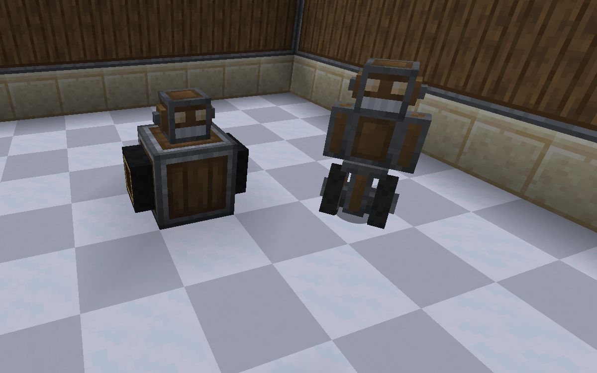
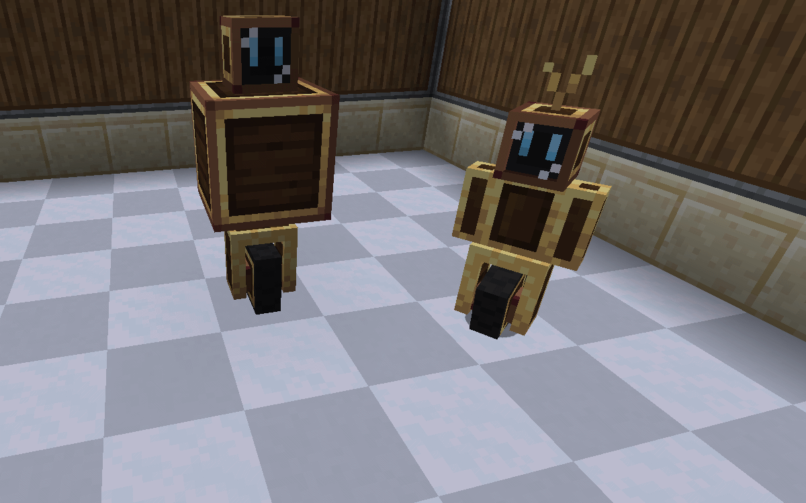

# 🤖 Robots
### Andesite Roller
A basic bot. Rollers have a higher speed than normal bots but they use more energy and are not durable.
* **Base Module Capacity:** 6
* **Upgrade Capacity:** 3
* **Efficiency:** N/A (In future updates)
* **Can run:** Andesite Modules

> **Assembled with:**  
> 1x Andesite Roller Head  
> 1x Andesite Casing  
> 2x Roller Wheel  
> 

***

### Brass Roller
A bit more advanced than Andesite Roller.
* **Base Module Capacity:** 10
* **Upgrade Capacity:** 6
* **Efficiency:** N/A (In future updates)
* **Can run:** Andesite & Brass Modules
* **Health & Armor:** 10 & 10

> **Assembled with:**  
> 1x Brass Roller Head  
> 1x Brass Casing  
> 1x Brass Wheel  
> 